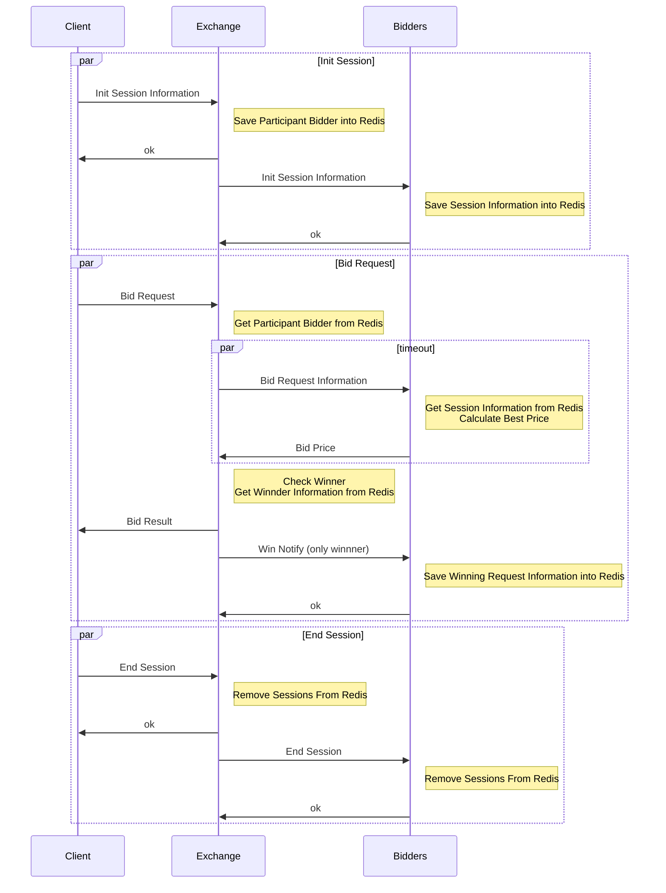

# Simple-RTB

## Bid Strategy

In most paper introduce First-Price Sealed-Bid Auction,
there often comes up a strategy that, if there are n people in auction, then everyone take the same strategy, bid (n-1)/n * expect value.
However, in this case we don't know how many bidders are there in this auction, so I comes up another idea.

Avg = (budget / impression_remain) will be the highest price as the expect value.
Assume that the price of the bidders between Avg and floor_price is uniform distribution.
Pr[winning a request] = (price - floor_price)/(Avg - floor_price)
And Expect vaue V is also (price - floor_price)/(Avg - floor_price)

I would suppose after the remains requests, I reach the value impression_remain
That is, (price - floor_price)/(Avg - floor_price) * estimated_traffic >= impression_remain
So price = impression_remain * (average - floor_price) / estimated_traffic + floor_price;

## System Diagram



## System Capacity

By using wrk, setting thread=12, connections=500, duration=10s 

```bash
wrk -s capacity.lua -t12 -c500 -d10s http://localhost:1337/bid_request
```

```
Running 10s test @ http://localhost:1337/bid_request
  12 threads and 500 connections
  Thread Stats   Avg      Stdev     Max   +/- Stdev
    Latency     1.06s   296.91ms   1.88s    67.88%
    Req/Sec    73.91     66.07   300.00     71.19%
  4439 requests in 10.05s, 1.46MB read
  Socket errors: connect 0, read 510, write 0, timeout 0
Requests/sec:    441.84
Transfer/sec:    148.86KB
```

## Starting Server

### By Makefile

By the script written in Makefile

- `make start`: run the both server
- `make clean`: stop and remove the server
- `make logs`: logs the exchange server
- `make logs_bidder`: logs the bidder server
- `make re`: restart te server

### By docker-compose

Two docker-compose.yml file in two directories.
Before running `docker-compose up -d`, please create docker network `RTB-connection` first
```bash
docker network create RTB-connection
```
then get into the specific folder
```bash
docker-compose up -d
```

### By Using Nodejs

Ensure nodejs, redis is installed.

- To set the environment variable
```bash
source .env
# DEFAULT_PATH=/usr/src/app
# REDIS_URL=redis://redis:6379
# BIDDER_PORT=8080
# EXCHANGE_PORT=1337
```
In which you should change REDIS_URL to your redis ref.

- install the dependencies packages
```
npm install
```
- run the server that you wish
```
node Exchange
node Bidders
```